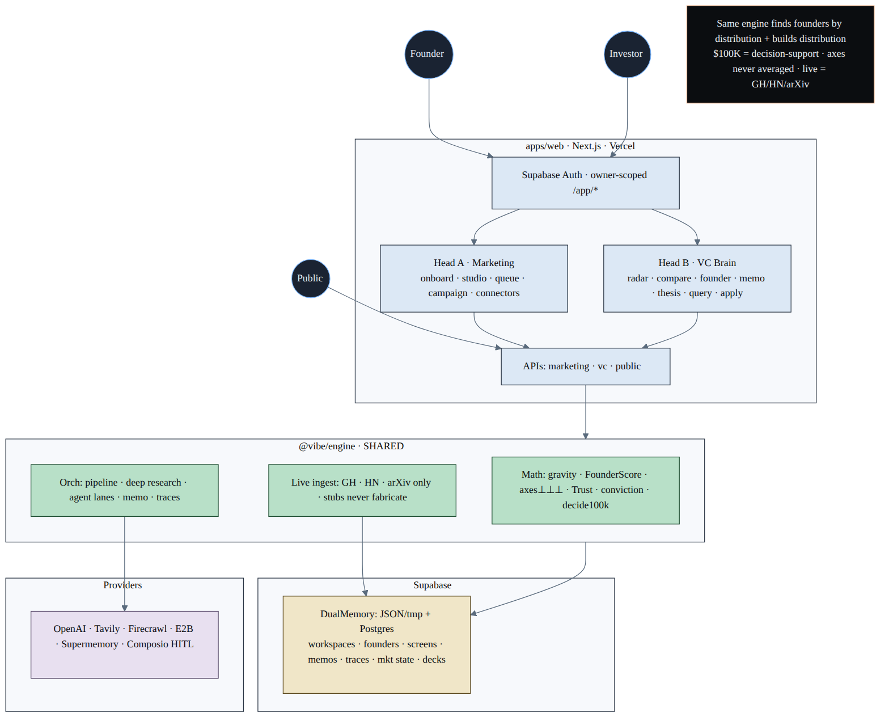
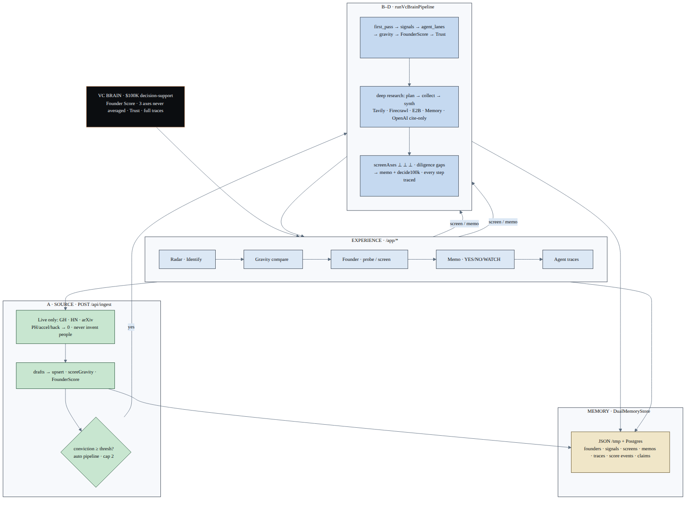

# vibemarketer

**Official site:** [www.vibemarketer.fun](https://www.vibemarketer.fun)  
**Repo:** [Anand-0037/thevibemarketing](https://github.com/Anand-0037/thevibemarketing)  
**Judge pack:** [`../hack/project files/JUDGES.md`](../hack/project%20files/JUDGES.md) · **Status:** [`../hack/STATUS.md`](../hack/STATUS.md)

> Cursor for marketing — brand brief, campaigns, and approval-gated drafts for SaaS founders.  
> **VC Brain** is the same engine’s sourcing head: find, screen, and diligence founders by **distribution gravity**, then recommend a **$100K** check.

---

## Hack-Nation · Challenge 02 — The VC Brain

| | |
|---|---|
| Track | **The VC Brain** (Maschmeyer Group) — only track submitted |
| Team ID | `026f67c5-25af-4105-ae6e-177dd10bc0bb` |
| Product frame | Marketing fleet = the company · VC Brain = first-class feature (`/vc-brain`, `/app/*`) |
| Unfair angle | **Distribution gravity** — earned attention vs pedigree; axes never averaged; Trust/Diligence kills weak claims |

**One sentence for judges:** Autonomous marketing agents for SaaS, with a VC Brain that ranks cold-start founders by public distribution signal and writes evidence-backed $100K memos.

---

## Problem

Shipping got cheap. **Distribution did not.**

Founders who can build still stall on Reddit, X, LinkedIn, SEO/AEO, and brand memory that resets every chat. Investors miss builders whose public footprint already shows pull — until a warm intro surfaces them weeks later.

Both are the same systems problem: **ingest public signal → persistent memory → evidence-backed reasoning → gated action.**

---

## Solution

```
                 vibemarketer.fun
        ┌─────────────────────────────────────┐
        │  Marketing fleet (main product)       │
        │  brand memory → draft → HITL → publish│
        └──────────────────┬────────────────────┘
                           │  @vibe/engine
        ┌──────────────────▼────────────────────┐
        │  VC Brain (Challenge 02)                │
        │  Identify → Activate → Converge         │
        │  → Screen → Diligence → $100K Decision  │
        └─────────────────────────────────────────┘
```

1. **Marketing head** — autonomous loops across founder channels with an autonomy dial (L1 HITL → L3 gated). Brand memory does not reset.
2. **Sourcing head (VC Brain)** — outbound Identify across live GitHub, HN, arXiv; Activate cold outreach; Converge into Screening; score on **three axes never averaged**; Diligence via per-claim Trust; Decision as an evidence memo.

We never invent people or companies. Unavailable sources return **zero rows**. Discovered authors are **candidates** until claimed / applied / verified.

---

## Build vs borrow

| Borrow | Build (moat) |
|--------|----------------|
| Composio (OAuth), Firecrawl, E2B, OpenAI, Supabase, Supermemory | Orchestration spine, distribution gravity, 3-axis screen, Diligence/Trust, Founder Score ledger, HITL, workspace isolation |
| MIT marketing skill playbooks | Agent lanes, traces, investor UX |

---

## Architecture

| Layer | Role |
|-------|------|
| `apps/web` | Next.js UI + **API routes (the backend)** |
| `packages/engine` | `@vibe/engine` — scoring, connectors, memory, memos |
| Supabase | Auth (JWT) + Postgres Memory ledgers (RLS, per-owner workspaces) |

There is **no separate backend service to deploy**. Vercel hosts the Next app; API routes run as serverless functions. Supabase is Auth + database.

### Whole system — one engine · two heads



*Marketing Fleet + VC Brain + `@vibe/engine` + Supabase + providers.*  
Live: [`/hack-nation-diag/architecture-whole.svg`](https://www.vibemarketer.fun/hack-nation-diag/architecture-whole.svg)

### VC Brain — Source → Screen → Diligence → Decide



*Memory × Intelligence × Experience · gravity · axes never averaged · Trust · traces.*  
Live: [`/hack-nation-diag/architecture-vc-brain.svg`](https://www.vibemarketer.fun/hack-nation-diag/architecture-vc-brain.svg)

Sources: Mermaid in [`../hack/diagrams/`](../hack/diagrams/) · static assets in [`apps/web/public/hack-nation-diag/`](./apps/web/public/hack-nation-diag/)

**Runtime contract**

- Authenticated user → owned workspace → live ingest → score → Diligence → memo  
- Dual-write to Supabase when `USE_POSTGRES_DUAL=1`  
- Approve → `queued` until a provider confirms a post ID/URL (stubs never fake `published`)

---

## Demo path (judges / video)

1. Sign up → `/app/radar` (empty is correct)  
2. **Identify · refresh** — live GitHub / HN / arXiv candidates  
3. `/app/compare` — top pair by distribution gravity  
4. Open a founder → **Screen** → Diligence / Trust → **$100K memo** + agent trace  
5. Optional: Activate → Converge · Studio / HITL · NL query  

---

## Local development

```bash
pnpm install
cp .env.example .env   # fill keys — never commit .env
pnpm test:engine
pnpm --filter web dev
```

---

## Honest labels

- Live Identify only (GitHub / HN / arXiv). PH / accelerator / hackathon connectors are **not configured** until real APIs exist.  
- Composio publish stays HITL / queued until OAuth + provider confirm.  
- OpenAI outage → deterministic scoring/memo math still works.  
- Known limits: decks on ephemeral disk; marketing posts not fully multi-tenant Postgres yet; memo/trace dual-write partial.

---

## License

Proprietary for now · contact via site footer / `NEXT_PUBLIC_CONTACT_EMAIL`.
